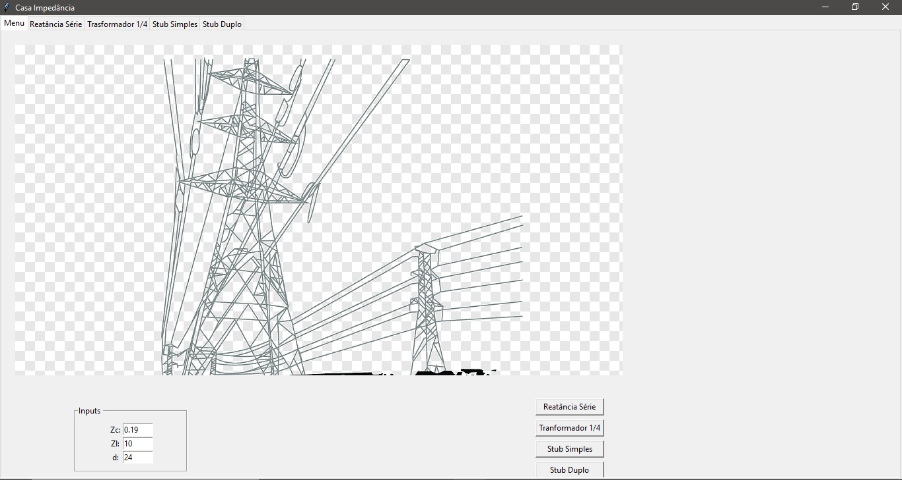

# Casamento de Impedância em uma linha de transmissão

## Conceito
A máxima transferência de potência de uma fonte para uma carga em uma linha de transmissão é obtida através do casamento de impedância.
Dentre os diversos métodos para se efetuar o casamento de impedância em uma linhas de transmissão, o aplicativo em questão foca nos métodos aplicados em linhas de transmissão com impedância característica real (sem perdas), a saber:
+ Casamento através da inserção de reatância em série com a carga
+ Casamento através do transformador de quarto de onda
+ Casamento através de stub simples
+ Casamento através de stub duplo

## Motivação
O aplicativo simula todo o processo matemático por trás da teoria do casamento de impedância, fornecedo um exemplo prático e funcional para diferentes situações

## Função
O aplicativo será capaz de: 
+ Manipular dados e condições de casamento inseridas pelo usuário;
+ Exibir os resultados tabelados em uma interface gráfica;
+ Apresentar curvas relativas a impedância e tensão na linha, além de outros dados relevantes, na interface gráfica;
+ Salvar as curvas apresentadas em arquivos de imagem.

## Instalação

É necessário Python 3.11 ou superior.
Faça o Download deste repositório.
No terminal da IDE ou Windows execute o comando "pip install -r requirements.txt"
Após isto, basta executar o programa "GUI.py"

## GUI e Tutorial

Mo meu principal, o usuário deverar preencher as informações de Impedância Característica Zc, Carga Zl e distância d (para o caso de stub duplo) e, após isto, deverá selecionar o tipo de casamento que deseja efetuar, dessa maneira o usuário será direcionado a respectiva aba contendo os gráficos e os dados tabelados:

