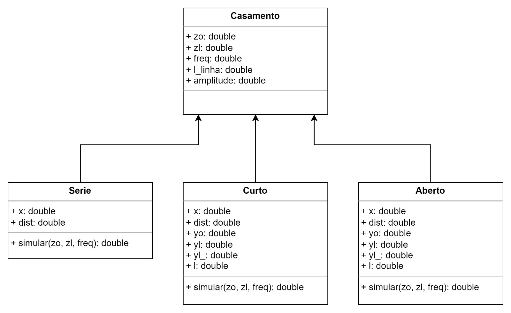

# Casamento de Impedância em uma linha de transmissão

## Conceito
A máxima transferência de potência de uma fonte para uma carga em uma linha de transmissão é obtida através do casamento de impedância.
Dentre os diversos métodos para se efetuar o casamento de impedância em uma linhas de transmissão, o aplicativo em questão foca nos métodos aplicados em linhas de transmissão com impedância característica real (sem perdas), a saber:
+ Casamento através da inserção de reatância em série com a carga
+ Casamento através de um stub em curto-circuito
+ Casamento através de um stub em aberto

## Motivação
O aplicativo simula todo o processo matemático por trás da teoria do casamento de impedância, fornecendo um exemplo prático e funcional para diferentes situações

## Função
O aplicativo será capaz de: 
+ Manipular dados e condições de casamento inseridas pelo usuário;
+ Exibir os resultados em uma interface gráfica;
+ Apresentar uma curva relativa a tensão na linha;
+ Salvar a curva apresentada em um arquivo de imagem.

## Diagrama de classes

## Fluxograma

## Instalação

+ É necessário Python 3.11 ou superior.
+ Faça o Download deste repositório.
+ No terminal da IDE ou Windows execute o comando "pip install -r requirements.txt"
+ Após isto, basta executar o programa "GUI.py", cujo arquivo deve estar na mesma pasta que "imagens" e "casamento.py".

# GUI e Tutorial

A biblioteca gráfica utilizada é a tkinter do python [https://docs.python.org/pt-br/3/library/tkinter.html].

## Menu
Mo menu principal, há 6 campos:

+ Impedância Característica(Ohm): impedância da linha de transmissão com a qual o usuário deseja casar a carga, dada em Ohms.
+ Impedância da Carga(Ohm): impedância da carga a ser casada com a linha de transmissão, dada em Ohms.
+ Frequência de excitação(MHz): frequência do sinal de tensão no gerador da linha de transmissão, dada em MHz.
+ Comprimento da linha(m): comprimento da linha de transmissão sem a carga acoplada.
+ Amplitude do gerador(Volts): amplitude da tensão senoidal do gerador.

E 5 botões:

+ Salvar valores: armazena os valores quando o usuário atualiza.
+ Casamento Série: navega para a aba "Casamento Série".
+ Stub em curto: navega para a aba "Stub em curto".
+ Stub em aberto: navega para a aba "Stub em aberto".
+ Alternar Tema: alterna a coloração da interface entre modo escuro e modo claro.

O usuário deverá preencher os 6 campos explicados acima e, em seguida, apertar o botão "Salvar valores" para então poder navegar para a aba desejada a partir dos botões de navegação (Casamento Série, Stub em curto e Stub em aberto).

## Aba Casamento Série
Ao apertar o botão "Casamento Série" no menu principal o usuário será direcionado para a aba abaixo:

Há 1 botão de navegação "Voltar" para que o usuário retorne ao menu principal.
O botão simular executa o seguinte procedimento:
+ Preenche os campos de resultados, que no caso do Casamento série são:
  + Reatância da Carga (Ohm): valor da reatância que deverá ser colocada em série com a carga para que haja o casamento de impedância com a linha, em (Ohm).
  + Distância da carga à reatância(m): distância, em metros, entre a carga e a ratância adicionada em série para que haja casamento de impedância na linha.
+ Gera um gráfico do perfil estacionário da onda de tensão na linha de transmissão para o instante inicial (apenas uma questão de referencial).

Apos apertar o botão "Simular", o perfil obtido será:

## Abas Stub em curto e Stub em aberto

Nas abas Stub em curto e Stub em aberto, após apertar o botão respectivo menu principal o usuário será direcionado para a aba abaixo (tome como exemplo a aba Stub em curto, a aba Stub em aberto funciona de maneira análoga):

Há 1 botão de navegação "Voltar" para que o usuário retorne ao menu principal.
O botão simular executa o seguinte procedimento:
+ Preenche os campos de resultados, que no caso do Stub em curto/aberto são:
  + Distância do stub à carga(cm): distância na linha, em centímetros, entre o stub e a carga para que haja o casamento de impedâncias.
  + Comprimento do stub(cm): comprimento, em centímetros, do stub para que haja casamento de impedância na linha.
+ Gera um gráfico do perfil estacionário da onda de tensão na linha de transmissão para o instante inicial (apenas uma questão de referencial).

Apos apertar o botão "Simular", o perfil obtido será:

